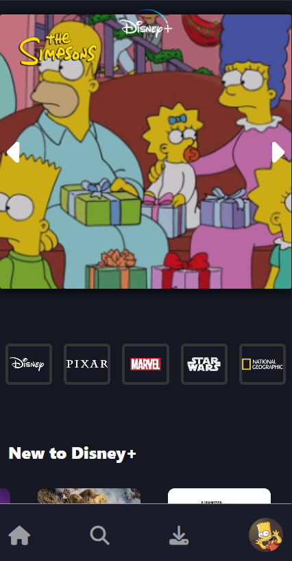

# Disney Plus Clone Frontend

Questo progetto è un **clone frontend di Disney Plus** realizzato con **Angular** utilizzando l'API di **The Movie Database (TMDb)**.  
Lo scopo è stato quello di ricreare l’interfaccia grafica di Disney Plus e le sue funzionalità principali, servendosi di componenti riutilizzabili e servizi condivisi.

## Descrizione del progetto

- **Tecnologie utilizzate**:  
  - **Angular**: per la costruzione dell’interfaccia utente, la struttura del progetto e la gestione delle rotte.  
  - **Tailwind**: per la gran parte dello stile e la strutturazione del sito.
  - **The Movie Database (TMDb) API**: per recuperare in tempo reale informazioni, poster e dettagli di film e serie TV.

- **Pagine realizzate**:  
  Sono state sviluppate tutte le sezioni principali presenti sul sito Disney Plus:
  - **Home**
  - **Search**
  - **Originals**
  - **Movies**
  - **Series**
  - **Watchlist**

  Ognuna di queste pagine presenta elenchi e slider di contenuti (film e serie), dettaglio degli elementi selezionati e la possibilità di gestire una watchlist personalizzata.

- **Componenti e servizi riutilizzati**:
  - **Spinner e Modali**: Implementati come servizi, in modo che possano essere facilmente richiamati e gestiti su qualsiasi pagina dell’applicazione. Lo spinner viene visualizzato durante il caricamento dei dati, mentre le modali vengono utilizzate per mostrare ulteriori informazioni o conferme senza lasciare la pagina corrente.
  - **Grid e Slider**: Sono stati creati come componenti riutilizzabili da includere in diverse sezioni del sito. In questo modo, la stessa logica e struttura di visualizzazione possono essere utilizzate su più pagine con un semplice import del componente, garantendo coerenza visiva e un minore sforzo di manutenzione.

## Screenshots

### Desktop


### Mobile



## Come eseguire il progetto in locale

1. **Clonare il repository**  
   ```bash
   git clone <URL_DEL_REPOSITORY>
2. **Accedere alla cartella del progetto**  
   ```bash
   cd <NOME_CARTELLA_PROGETTO>
3. **Installare le dipendenze**  
   ```bash
   npm install
4. **Avviare il server di sviluppo**  
   ```bash
   ng serve 
5. **L’applicazione sarà disponibile all’indirizzo:**
    http://localhost:4200/
